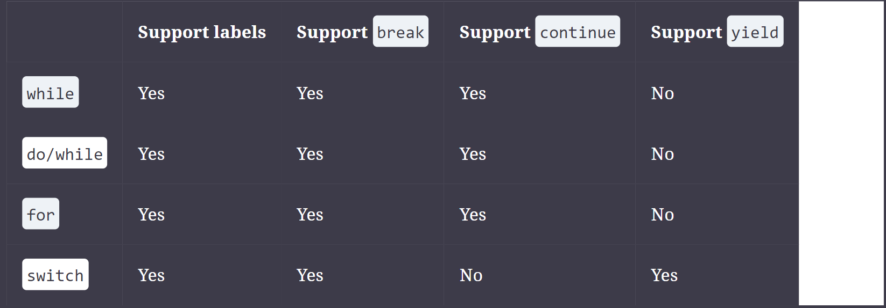

# Chapter 1  Building Blocks

* javac: Converts .java source files into .class bytecode
* java: Executes the program
* jar: Packages files together
* javadoc: Generates documentation

---
* The method name and parameter types are called the method signature
       
         public int numberVisitors(int month) {
         return 10;
         }
    the method signature is `numberVisitors(int)`
---

    // A single-line comment
    
    
     /*Multiple
     *line comment
     */
    
     /**
     *Javadoc multiple-line comment
     *@author Jeanne and Scott
     */

# Chapter 3 Making Decisions

* Boilerplate code is code that tends to be duplicated throughout a section of code over and over again in a similar manner.

    void compareIntegers(Number number) {
        if(number instanceof Integer data) { 
        System.out.print(data.compareTo(5));
        }
    }
The variable data in this example is referred to as the pattern variable.

    Integer value = 123;
    if(value instanceof Integer) {}       // COMPILE                 
    if(value instanceof Integer data) {}  // DOES NOT COMPILE
While the second line compiles, the last line does not compile because pattern matching requires that the pattern variable type Integer be a strict subtype of Integer.

## Flow scoping
    CASE 1:
    if (number instanceof Integer data && data.compareTo(5) > 0) // COMPILE
    if(number instanceof Integer data || data.compareTo(5)>0)  // DOES NOT COMPILE

    CASE 2:
    if (number instanceof Integer data)
        System.out.print(data.intValue());
     System.out.print(data.intValue());  // DOES NOT COMPILE

    void printOnlyIntegers(Number number) {
        if (!(number instanceof Integer data))
            return;
        System.out.print(data.intValue()); // COMPILE
    }
This means that when the last line of the method is reached, the input must inherit Integer, and therefore data stays in scope even after the if statement ends.

## Switch
**The following is a list of all data types supported by switch statements:**
* int and Integer
* byte and Byte
* short and Short
* char and Character
* String
* enum values
* **var (if the type resolves to one of the preceding types)**

_**NOTE:** Notice that **boolean, long, float, and double** are excluded from switch statements, as are their associated Boolean, Long, Float, and Double classes. The reasons are varied, such as boolean having too small a range of values and floating-point numbers having quite a wide range of values. For the exam, though, you just need to know that they are not permitted in switch statements._

---

* The values in each case statement must be compile-time constant values of the same data type as the switch value.  **Methods are not evaluated until runtime**

* Unlike a traditional switch statement, though, switch expressions have special rules around when the **default** branch is **required**.

## FOR

A **for-each loop** can be executed on **any Collections object** that implements **java.lang.Iterable**, **such as List or Set, but not all Collections classes, such as Map**

## Adding Optional Labels

    static void  method1() {
        int[][] myComplexArray = {{5,2,1,3},{3,9,8,9},{5,7,12,7}};

        OUTER_LOOP:  for(int[] mySimpleArray : myComplexArray) {
            INNER_LOOP:  for(int i=0; i<mySimpleArray.length; i++) {
                System.out.print(mySimpleArray[i]+"\t");
            }
            System.out.println();
        }
    }
Labels follow the same rules for formatting as identifiers. For readability, they are commonly expressed using uppercase letters in snake_case with underscores between words.

